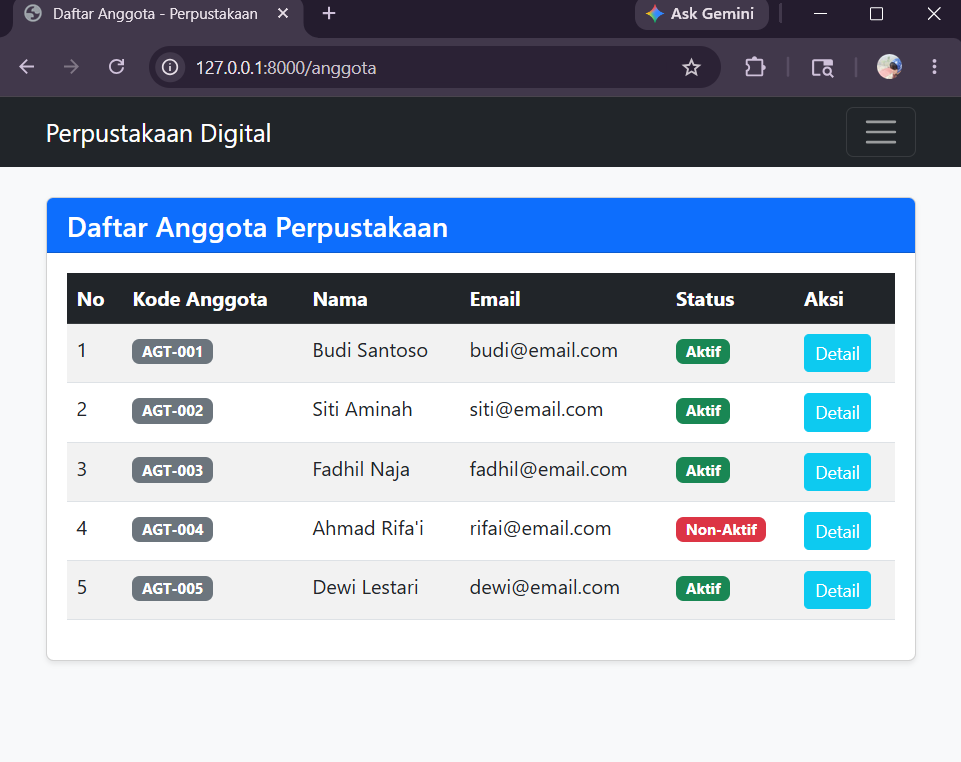
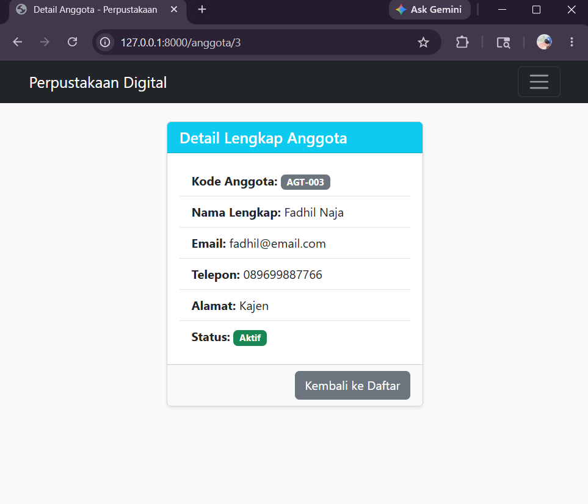
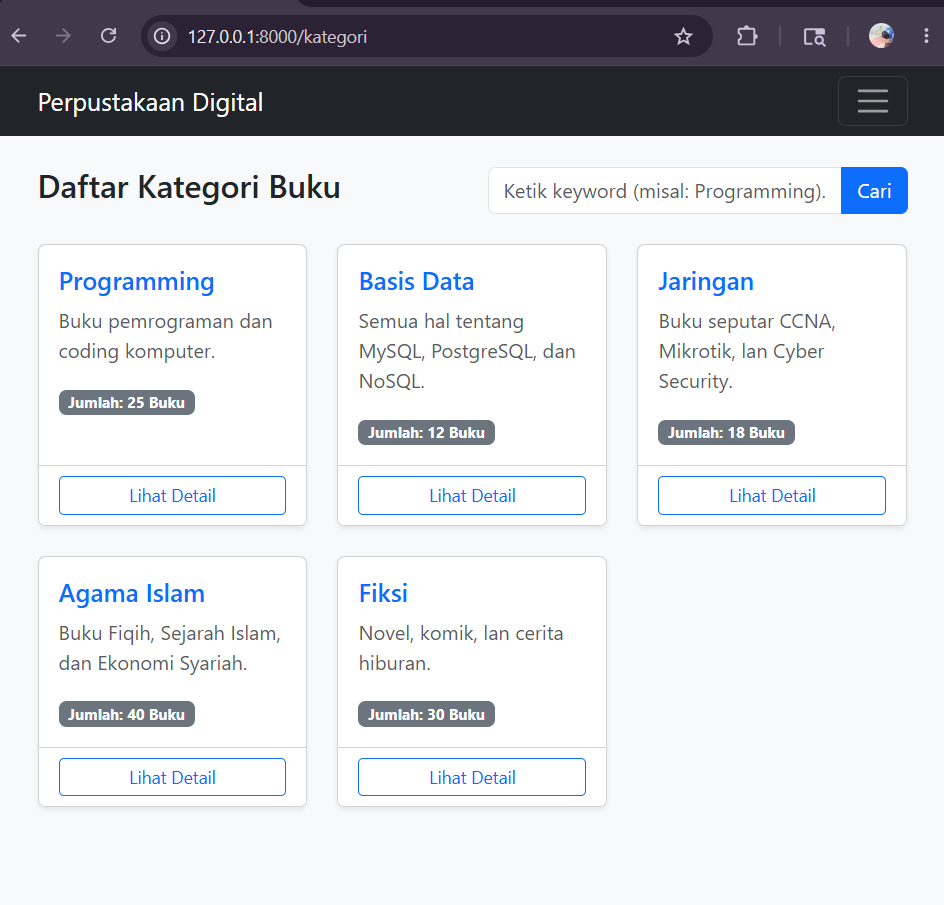
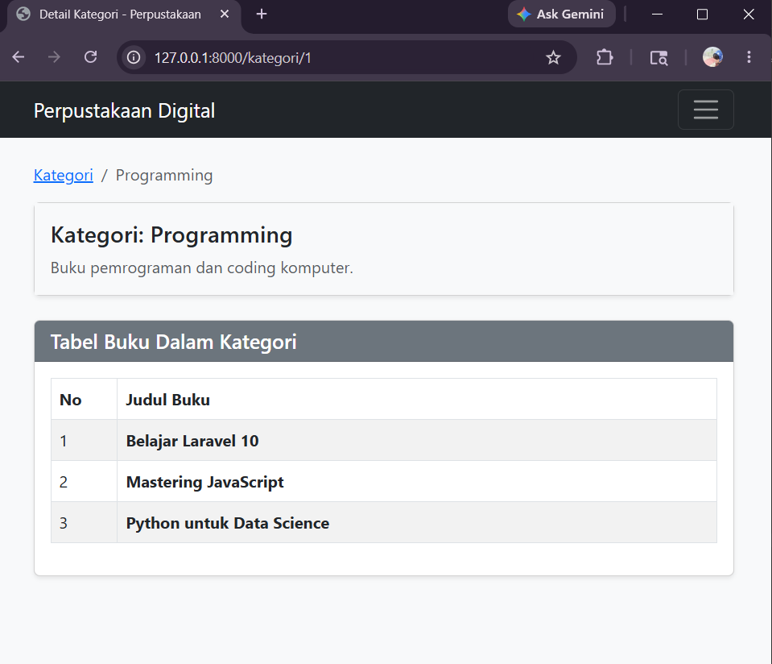
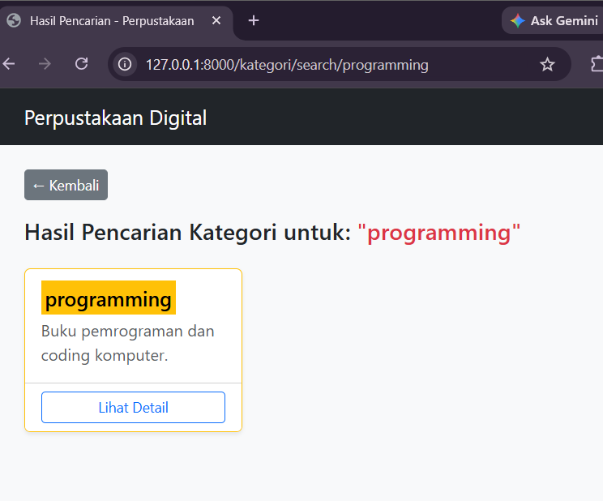

# 📚 Tugas Pertemuan 9 - Pemrograman Web (Informatika UIN Gusdur)

Implementasi Tugas Terstruktur MVC (Routing, View, Controller) dengan penambahan Master Layout dan Named Routes (+Bonus 10%).

## Identitas
- **Nama:** Fadhil Naja
- **Prodi:** Informatika
- **Fakultas:** Ekonomi dan Bisnis Islam (FEBI)

---

##  Fitur & Rute Sistem Perpustakaan

### Tugas 1: Routing dan View untuk Anggota
* **Daftar Anggota** (`/anggota`) - Menampilkan minimal 5 data anggota perpustakaan menggunakan tabel Bootstrap 5.
* **Detail Anggota** (`/anggota/{id}`) - Menampilkan informasi lengkap data anggota tertentu menggunakan komponen Card Bootstrap 5.

### Tugas 2: Controller untuk Kategori Buku (MVC)
* **Daftar Kategori** (`/kategori`) - Menampilkan daftar kategori buku menggunakan Card Bootstrap 5 lewat `KategoriController@index`.
* **Detail Kategori** (`/kategori/{id}`) - Menampilkan detail kategori beserta sub-tabel daftar buku di dalamnya lewat `KategoriController@show`.
* **Pencarian Kategori** (`/kategori/search/{keyword}`) - Fitur filter pencarian kategori dilengkapi highlight keyword lewat `KategoriController@search`.

---

## 📸 Dokumentasi Bukti Hasil di Browser

### 👥 1. Halaman Daftar Anggota (`/anggota`)

### 🔍 2. Halaman Detail Anggota (`/anggota/3`)

### 📂 3. Halaman Daftar Kategori Buku (`/kategori`)

### 📖 4. Halaman Detail Kategori (`/kategori/1`)

### ⚡ 5. Halaman Hasil Pencarian Kategori (`/kategori/search/programming`)
